# Docker Portainer
> Docker 를 브라우저에서 관리할 수 있게 도와주는 GUI 툴
---
> ## 1. Portainer Image 가져오기
> 이미지로 대체한다.  
> 자세한 설명은 생략한다.
> 
> 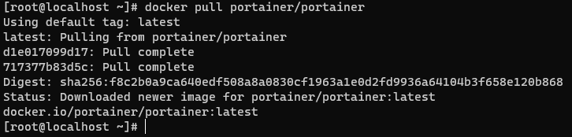
> ``` bash
> docker pull portainer/portainer
> ```
---
> ## 2. Portainer 컨테이너 실행하기
> 실행 명령어로 대체한다.  
> 자세한 설명은 생략한다.
> ``` bash
> docker run -itd \
> --name portainer \
> -v /var/run/docker.sock:/var/run/docker.sock \
> -v portainer_data:/data \
> -p 9000:9000 \
> --restart always portainer/portainer
> ```
---
> ## 3. Portainer 접속
> 컨테이너 실행 명령어를 변경하지 않았다면 Docker 가 설치되어 있는 호스트와 9000 포트로 접속이 가능하다.  
> 브라우저를 하나 열어서 XXX.XXX.XXX.XXX:9000 으로 접속하면 portainer 화면이 보일 것이다.  
---
> 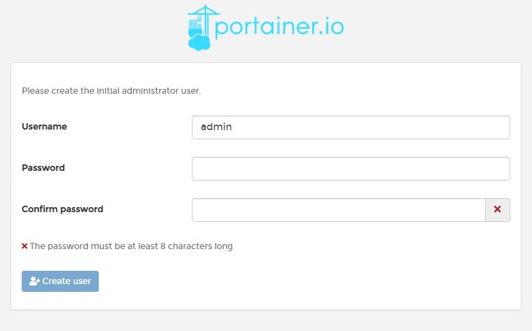  
> 최초에 관리자 계정을 만드는 화면이 나올텐데 아이디와 비밀번호를 입력하면 접속이 된다.  
---
> 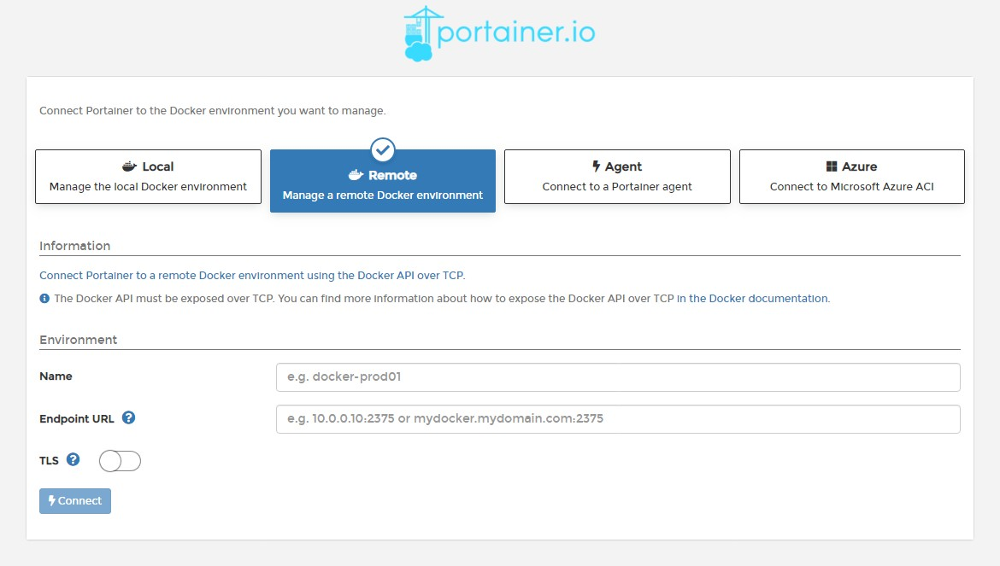  
> 접속 후에는 Docker 유형을 선택하는 화면이 나타난다.  
---
> 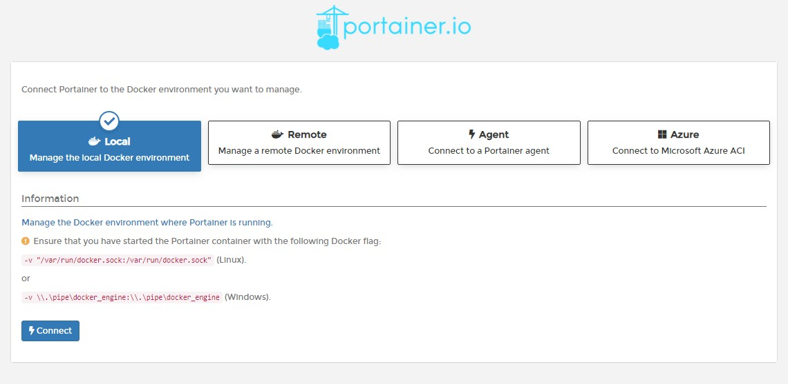  
> 다른 항목은 다음에 알아보기로하고 local 로 선택한다.  
> local 은 portainer 가 설치된 docker 를 가져오는 옵션이다.  
---
> 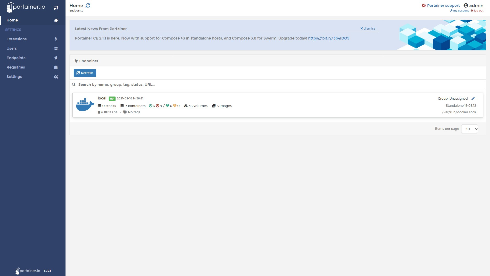  
> 연결이 정상적으로 되면 docker 목록에서 local docker 가 보일 것이다.  
---
> 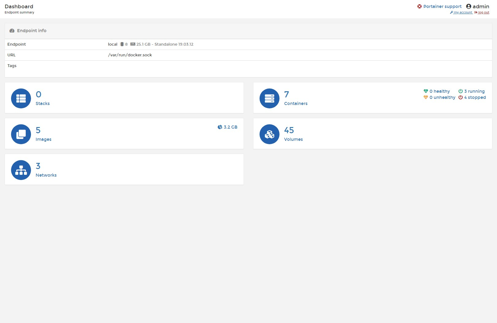  
> local docker 에 접속하면 보이는 dashboard 화면이다.  
---
> 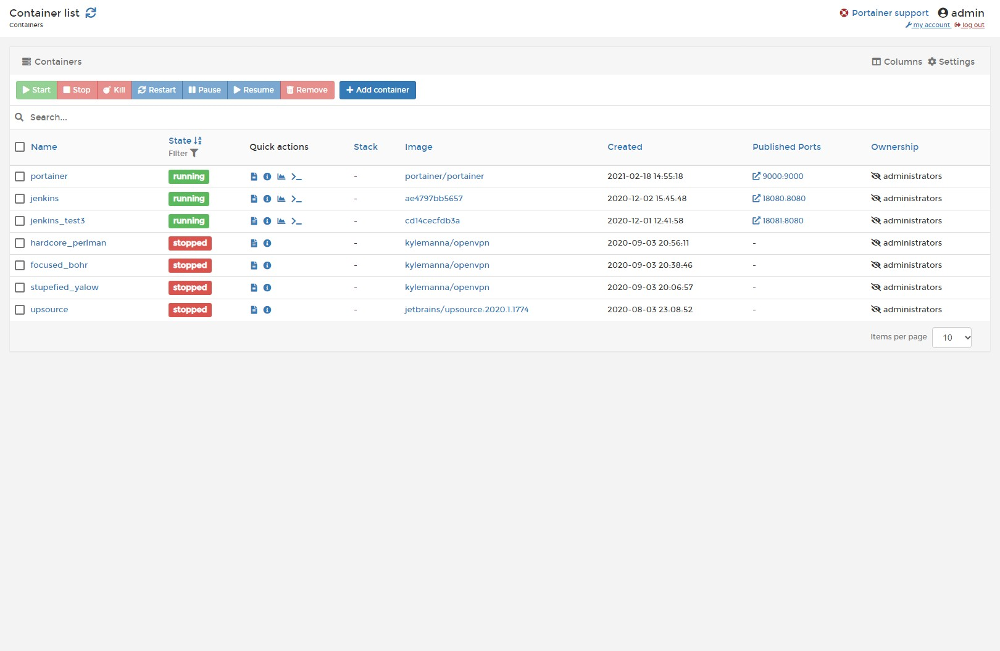  
> container 목록 화면이다.
---
> 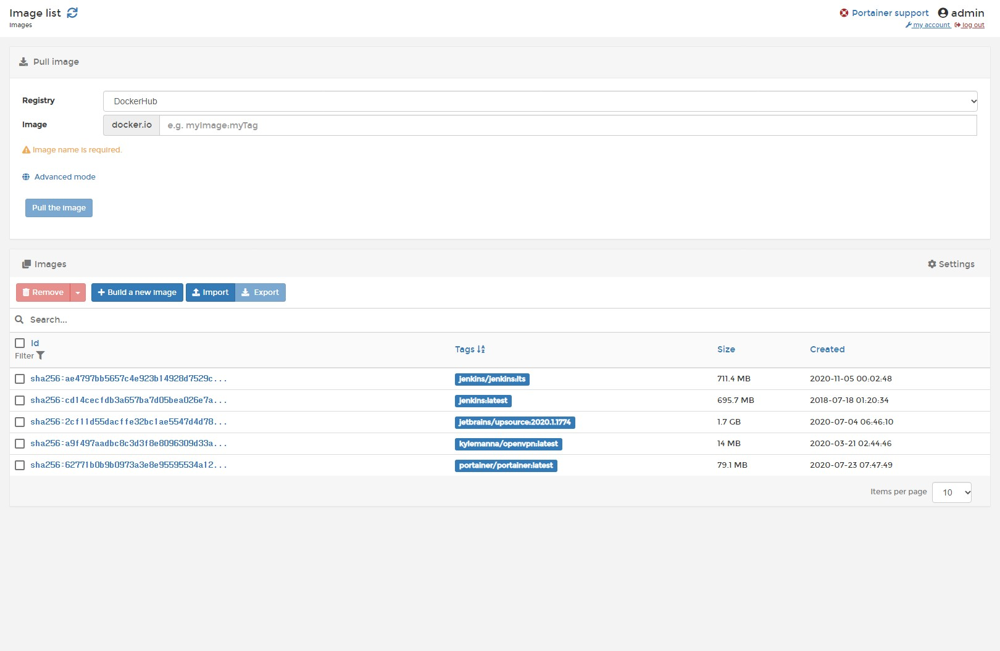  
> 이미지 목록 화면이다.  
---
> 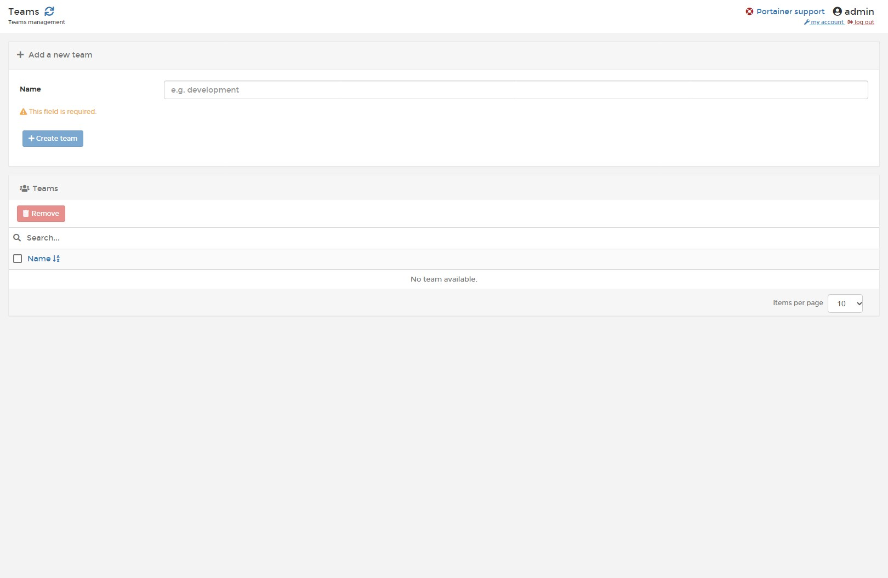  
> 팀 관리하는 화면이다.  
> 팀 단위로 권한을 줄 수 있기때문에 팀 관리는 노가다를 방지한다.  
---
> 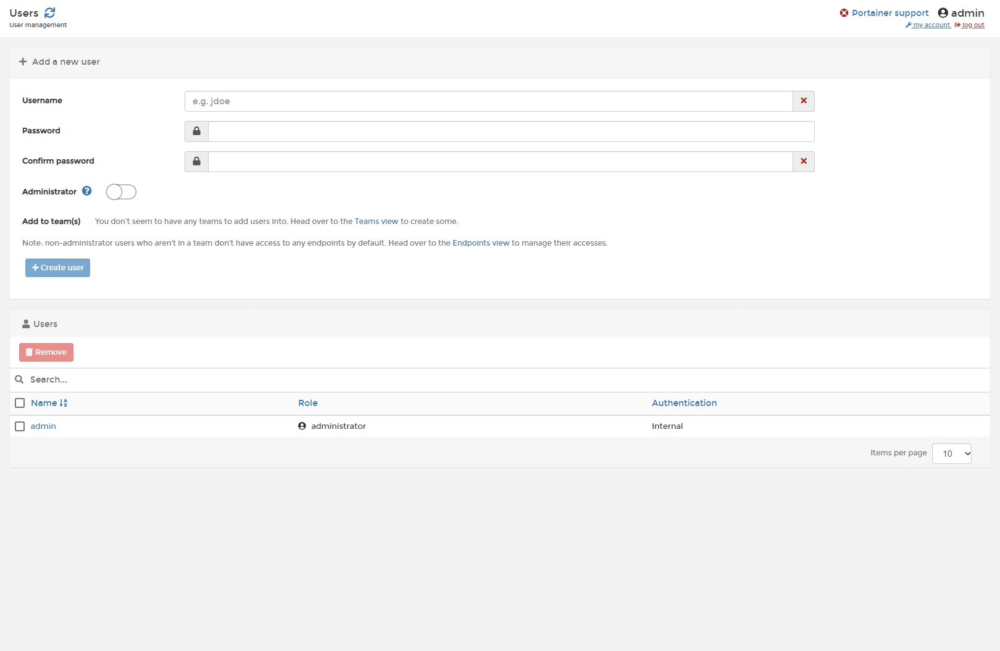  
> 사용자 생성 화면이다.  
> 사용자를 생성할때 teams 에서 생성한 팀을 할당할 수 있다.  
> 팀과 사용자 권한 관리는 생략한다.  
## 4. 이미지 및 컨테이너 관리
> 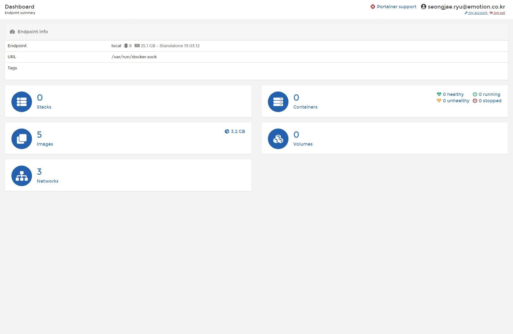  
> 생성한 사용자로 로그인한 dash 보드 모습이다.  
> root 권한으로 생성한 컨테이너는 보이지 않기때문에 컨테이너 목록이 없는 것을 확인할 수 있다.  
> 이미지를 하나 받아서 컨테이너를 생성해보는 시간을 가져보자.
---
> 
> Ubuntu 이미지를 하나 받아오는 모습이다.  
> 간단하게 이미지 이름과 버전만 쓰고 Pull the image 버튼을 클릭하면 된다.  
---
> 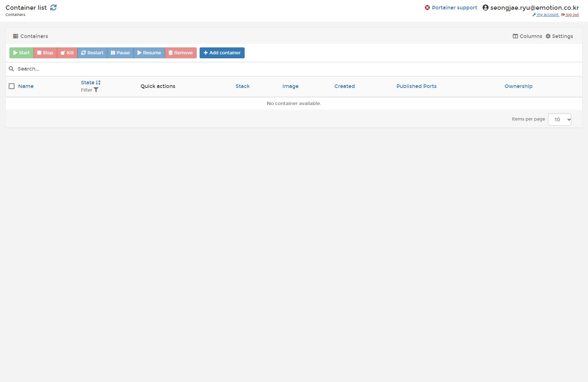  
> 컨테이너 목록 페이지에서 Add container 버튼을 클릭하면 컨테이너 생성 페이지로 넘어간다.
---
> 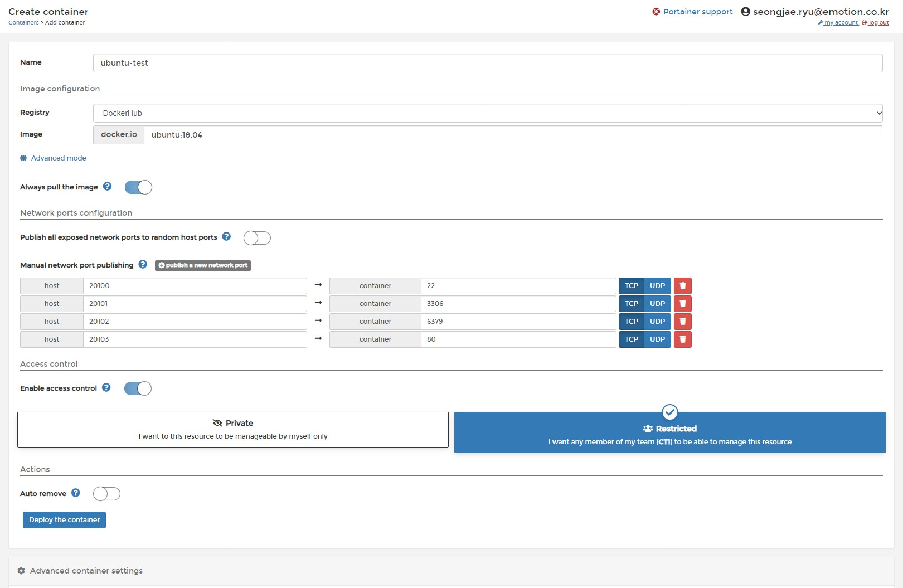  
> Deploy the container 버튼이 중간에 위치하고 있어 Advanced container settings 전에 클릭하지 않도록 주의해야한다.  
> |이름|설명|
> |-|-|
> |Name|container 이름을 설정한다.|
> |Image|이미지 이름을 입력한다.|
> |Network ports configuration|포트 설정 구역이다. +publish a new network port 버튼을 클릭하면 작성폼이 생성된다.|
> |host|외부에서 접속할때 사용될 포트|
> |container|container 내부에서 사용될 포트|
> |Access control|권한 설정. private 으로 설정하면 다른 사용자는 볼 수 없다.|
> |Adviced container settings|console 이나 restart policy 설정등을 할 수 있다.|
> |Deploy the container|container 를 생성한다.|
---
> 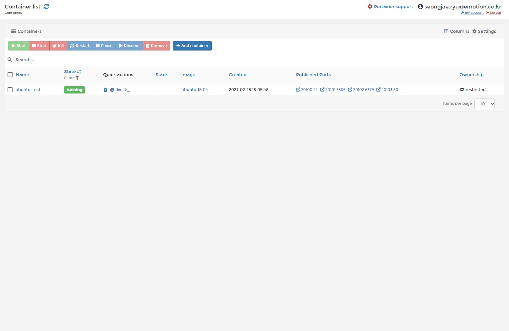  
> 생성된 컨테이너를 목록 페이지에서 확인할 수 있다.
---
> 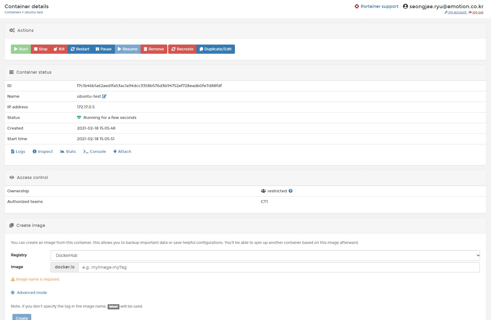  
> 컨테이너의 상세 페이지.  
> \>_Console 버튼을 클릭해보자.  
---
> 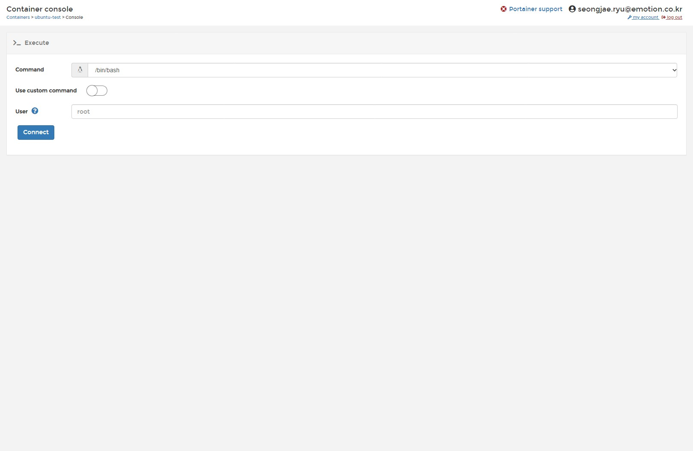  
> Connect 버튼을 클릭해보자.  
---
> 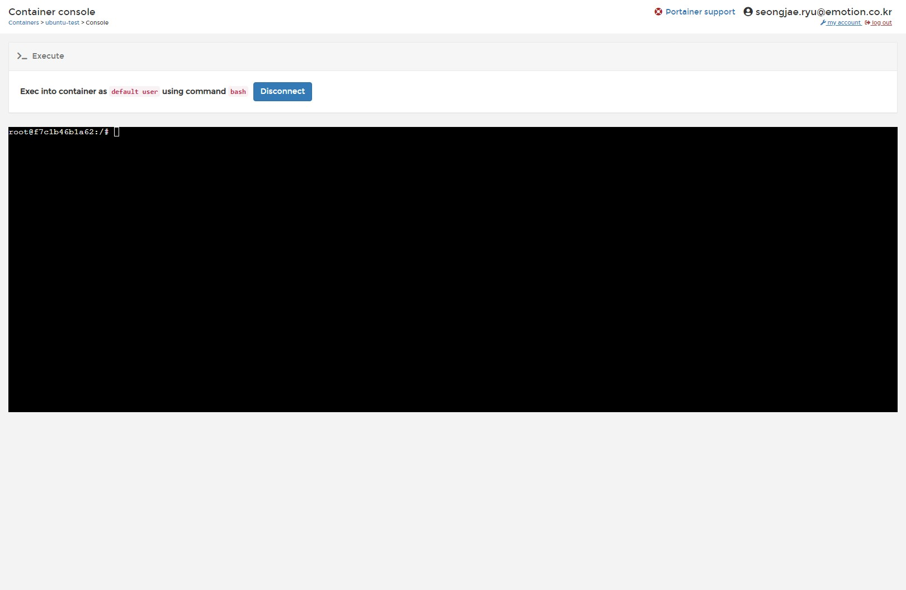
> 그렇다.  
> 여기서 terminal 접속이 가능하다.
## 5. 장점
> GUI 화면이기때문에 접근성이 좋아진다.  
> 그래서 명령어를 모든 인원이 알지 못하더라도 모든 인원이 컨테이너 관리가 가능하다.
